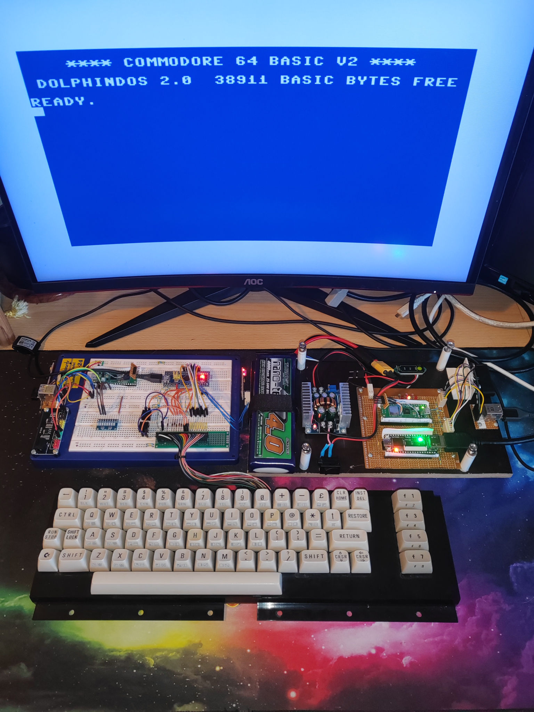
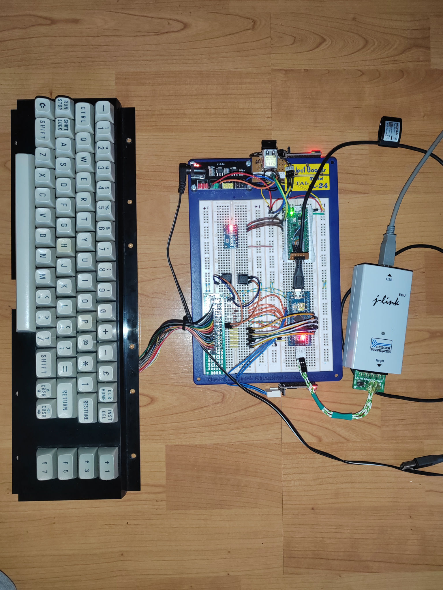

# C64UsbKeyboard
### What it does
Connects old Keyboards from Commodore 64 machines to USB, so you can plug them into Retro [C64Nano](https://github.com/MiSTle-Dev/C64Nano) devices. 

 

On the left side the breadboard prototype with an aditional RP2040. Right to it my hand soldered C64Nano powered by battery.    

## Why?
Reviving a 40-year-old computer is, well, a questionable idea. But when I heard about Stefan Voss's truly amazing project, I simply had no choice. I had to rebuild it.

Read more about this Retro Computing project here: [C64Nano](https://github.com/MiSTle-Dev/C64Nano?tab=readme-ov-file) and  [MiSTle Develoment](https://github.com/MiSTle-Dev).
Essentially, it's an FPGA and a microcontroller that have been put together to rebuild old computers.

The C64 Nano was working, and I had a great summer playing all the old games I'd played decades ago. But something was missing for a proper retro machine. I remembered buying a broken C64 at a flea market years ago, and that was it! I wanted to take that case and put everything in it. Perfect.

Without question, the original keyboard must work, and that brings us to the point. How do we connect this old keyboard to the C64Nano Companion Board?

To solve this, I thought in many directions, for example extend the Companion Board with a I2C interface, or use the [WeAct RP2350B](https://github.com/WeActStudio/WeActStudio.RP2350BCoreBoard/tree/main) board as Companion, which has plenty of IOs. 

The solution implemented here, simply uses a Bluepill board connected to the USB interface of the C64Nano computer. Easy to build, easy to connect and I have plenty of those boards lying around.

 

The breadboard with keyboard and programmer. 

After a short search, I found Bob Grant's article in which he described exactly what I wanted to do: [Use a Real Commodore 64 as a USB Keyboard for the VICE emulator](https://bytesnbits.co.uk/commodore-64-usb-keyboard/). He even published his code: [ArduinoKeyboard_C64.ino](https://github.com/getis/c64-usb-keyboard).

Bob uses the Arduino keyboard library, which, however, takes into account the country-specific keyboard layout.
I wanted a mapping of the keyboard matrix to HID codes. This approach is more transparent and easier to debug.

## How to
Well, have a look into the doc folder, there is the schematic. Solder a prototype board, build your own PCB, do what you want :-)

The Bluepill board I used is a Stm32F103C8T6, programmed with a JLink Edu device. 
If you don't want to build the code, simply flash the [release binaries](https://github.com/Linoprit/C64UsbKeyboard/releases). Use a [ST-Link](https://www.google.com/search?q=st+link) device, if you don't own a Segger JLink.

To build the project, you need to install [PlatformIo](https://platformio.org/). The project settings are in platformio.ini.

In the doc folder are some other documents I found usefull. Use them as reference.

## The code
Overall, I used Bob's software and the Arduino Keyboard Library source code.

One small problem arose with the cursor movement of the companion board's OSD. It doesn't accept Shift + Arrow-Up. Therefore, there's a block in the code that intercepts this key combination and sends the correct HID code for Arrow-Up.

Another question was, what to do with the F12 and the play tape keys. Fortunately Bob added the Restore key to the matrix with an addtional row and column. So I simply added two buttons into the matrix and mapped them to corresponding functions.

Oddly enough, I was able to do without key debouncing. If problems arise unexpectedly, it can easily be added later.

> Unplug the Bluepill from USB, before flashing. Otherwise, there is a good chance your host's USB-Driver will get crashed and you need to reboot. The Stm32f103 has no automatic disconnect circuit.

 

Hope this project is useful to someone.

Have fun.

